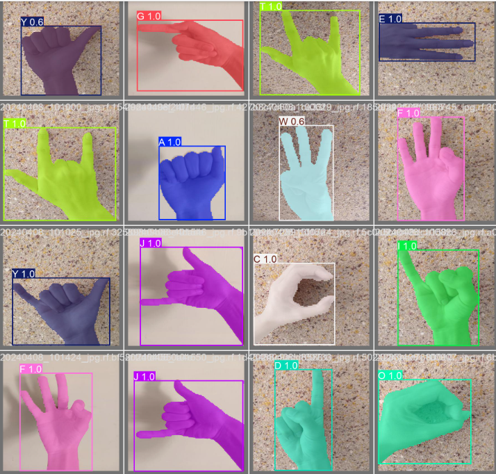
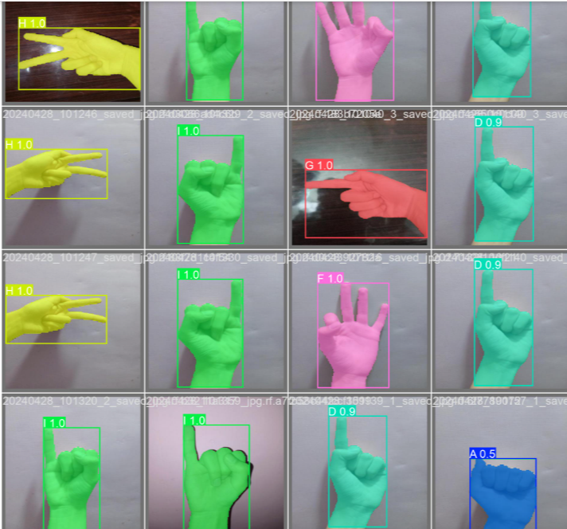

# (A–Z) Sign Language Segmentation

A deep learning project that performs **pixel-level segmentation** of hand gestures representing American Sign Language (ASL) alphabets A to Z. Unlike object detection, this project identifies the **exact hand region** in each frame using a segmentation model, offering more precise understanding of hand shapes for potential sign language translation systems.

---

## Key Features

- Segments ASL signs (A–Z) at the pixel level
- Uses a custom dataset of 4000+ annotated hand images
- Trained using **Yolov9**
- Annotations prepared with **Roboflow** (segmentation masks)
- Runs on **Google Colab** with real-time inference support
- Clear visualization of segmentation outputs

---

## Sample Outputs

- 
- 

---

## Dataset

- 4000+ images of hand signs A–Z, personally collected
- Annotated with **segmentation masks** via [Roboflow](https://roboflow.com)
- Exported in standard format(yolov9)
- The dataset is not included in the repo due to size

---

## How It Works

1. Hand gesture images are collected and labeled with segmentation masks
2. The model is trained on pixel-wise classification of hand regions
3. During inference, the system highlights the exact hand contour
4. Segmented region can be used for downstream classification (A–Z recognition)

---

## Tech Stack

| Component           | Tool / Framework        |
|---------------------|-------------------------|
| Language            | Python                  |
| Segmentation Model  | Yolov9   |
| Dataset Tool        | Roboflow                |
| Visualization       | OpenCV / Matplotlib     |
| Platform            | Google Colab            |

---
## Author

Built by Mariyam Chauhdry – AI Engineer

Feel free to connect with me on [LinkedIn](https://www.linkedin.com/in/mariyam-chauhdry-592231270)

